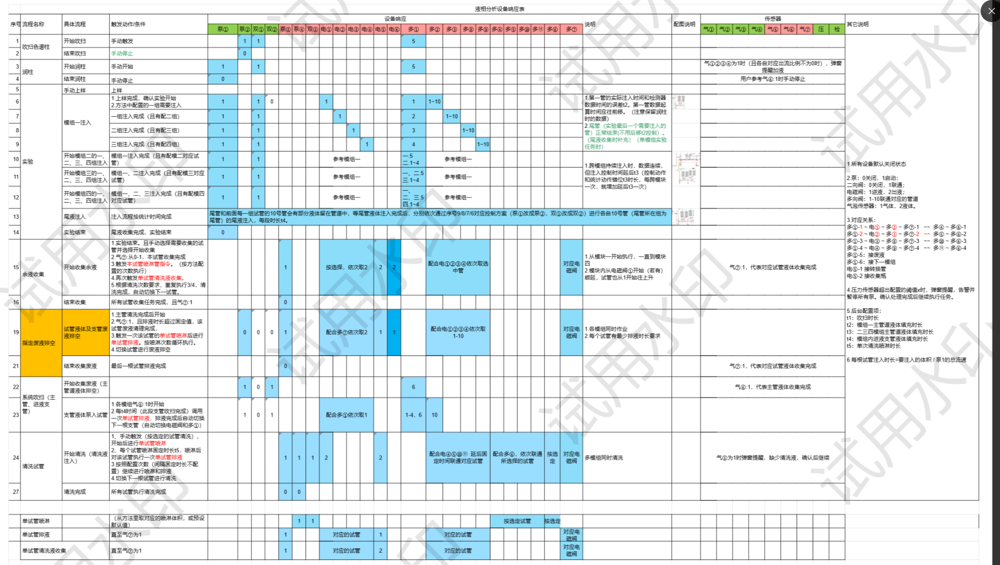

# 液相色谱系统硬件交互逻辑说明



## 一、系统硬件架构概述

系统由两个主要模块组成：
1. **主机模块**（左侧）：包含流动相供给、高压泵、检测器等核心组件
2. **收集模块**（右侧）：包含多通阀矩阵和试管架系统

## 二、硬件组件详细说明

### 2.1 流动相供给系统
- **流动相A/B/C/D**：四种不同的流动相储罐
- **电磁阀控制**：
  - 电①-电④：控制四种流动相的选择
  - 通过电磁阀开关组合实现流动相切换

### 2.2 泵系统
- **四合一高压恒流泵**（泵①）：主泵，提供恒定流速
- **空气泵**（泵②）：用于系统吹扫
- **辅助泵**（泵③/泵④）：协助样品输送和清洗

### 2.3 检测系统
- **检测器**：UV检测器，实时监测吸光度
- **压力传感器**：监控系统压力
- **气泡传感器**（气①-气⑦）：
  - 气①-气④：主机端管路气泡检测
  - 气⑤-气⑦：收集端管路气泡检测

### 2.4 多通阀系统
系统采用多通阀矩阵设计，实现灵活的流路切换：
- **多①-多④**：控制第一层试管架（1-40号试管）
- **多⑤-多⑧**：控制第二层试管架（41-80号试管）
- **多⑨-多⑪**：控制第三层试管架（81-120号试管）

每个多通阀有10个通道，通过组合切换实现精确定位：
- 例如：收集到12号试管 = 多①切2通道 + 多③切2通道

### 2.5 试管架系统
- **40ml试管架**：4列×10行，共40个位置
- **100ml试管架**：4列×6行，共24个位置
- 每个试管位置由两个多通阀协同控制

## 三、系统工作流程

### 3.1 起始状态

**系统初始化流程**：
1. **设备自检**（第1-3行）
   - 开始运行检查
   - 控制电脑连接验证
   - 仪器状态确认

2. **管路准备**（第4-6行）
   - 润柱：手动触发或自动判断
   - 管路清洗：手动或自动模式
   - 吹扫上样：准备样品注入

3. **压力建立**（第7行）
   - "模拟一压入电流（且有配三组）"
   - 建立初始系统压力
   - 验证压力传感器读数正常

### 3.2 核心运行流程

#### 3.2.1 样品分离阶段（第8-14行）

**电磁阀时序控制**：
```
步骤1：上样准备
- 电磁阀状态：电①开，电②③④关
- 泵①启动，建立流速
- 监测压力值：1-10 bar范围

步骤2：样品注入
- 三组压入电流（且有配三组）
- 参考模拟值监控
- 压力监测：确保在安全范围

步骤3：分离运行
- 梯度程序执行
- 实时UV检测
- 压力持续监控
```

#### 3.2.2 馏分收集阶段（第15-20行，蓝色区域）

**智能收集策略**：
```
触发条件判断：
IF UV吸光度 > 阈值 THEN
    开始收集序列
    
收集流程：
1. 配合多心收次数判断
   - "配合多心收次数1"：单次收集模式
   - "配合多心收次数1:10"：连续收集1-10号试管
   
2. 多通阀切换逻辑
   FOR 试管号 = 1 TO 目标试管号
       计算阀门位置：
       阀1位置 = (试管号-1) DIV 10 + 1
       阀2位置 = (试管号-1) MOD 10 + 1
       执行切换：
       多通阀1.切换(阀1位置)
       多通阀2.切换(阀2位置)
       等待切换完成(500ms)
   END FOR

3. 收集确认
   - 检查气泡传感器状态
   - 验证液体进入试管
   - 记录收集体积和时间
```

#### 3.2.3 试管清洗阶段（第21-24行）

**清洗循环流程**：
```
清洗模式选择：
- 模式1：普通清洗
  电①②关闭，电⑤⑥开启
  泵③启动，流速2ml/min
  持续30秒

- 模式2：高压清洗（第24行）
  "清洗收管（高流速压入）"
  电⑤⑥全开
  泵③高速运行(5ml/min)
  配合气泡传感器检测清洗效果
```

### 3.3 终止状态

**系统终止条件**：
1. **正常终止**（第26-27行）
   - 所有样品处理完成
   - 执行最终清洗程序
   - 系统进入待机状态

2. **异常终止**
   - 压力超限（>最大压力限制）
   - 检测到持续气泡
   - 用户手动停止

**终止流程**：
```
终止序列：
1. 停止所有泵
2. 关闭所有电磁阀
3. 多通阀复位到初始位置
4. 记录终止状态和原因
5. 生成运行报告
```

## 四、关键判断逻辑

### 4.1 压力判断
```python
def pressure_monitor():
    """压力监控逻辑"""
    current_pressure = read_pressure_sensor()
    
    if current_pressure < 1:
        # 压力过低，可能有泄漏
        return "LOW_PRESSURE_WARNING"
    elif current_pressure > 200:
        # 压力过高，可能堵塞
        return "HIGH_PRESSURE_ALARM"
    else:
        # 压力正常
        return "NORMAL"
```

### 4.2 气泡检测判断
```python
def bubble_detection():
    """气泡检测逻辑"""
    bubble_sensors = [气1, 气2, 气3, 气4, 气5, 气6, 气7]
    
    for sensor in bubble_sensors:
        if sensor.detect_bubble():
            # 检测到气泡
            location = sensor.get_location()
            handle_bubble(location)
            return f"BUBBLE_DETECTED_AT_{location}"
    
    return "NO_BUBBLE"
```

### 4.3 收集切换判断
```python
def collection_decision(uv_signal, gradient_time):
    """收集切换决策"""
    # 基于UV信号判断
    if uv_signal > threshold:
        if not collecting:
            start_collection()
            return "START_COLLECT"
    else:
        if collecting and uv_signal < threshold * 0.8:
            stop_collection()
            switch_to_next_tube()
            return "SWITCH_TUBE"
    
    # 基于时间判断
    if time_based_collection:
        if current_time - last_switch > interval:
            switch_to_next_tube()
            return "TIME_SWITCH"
    
    return "CONTINUE"
```

## 五、多通阀配置映射表

### 5.1 试管位置与阀门对应关系
| 试管编号 | 多通阀1 | 通道1 | 多通阀2 | 通道2 |
|---------|---------|-------|---------|-------|
| 1-10    | 多①    | 1-10  | 多②    | 1     |
| 11-20   | 多①    | 1-10  | 多②    | 2     |
| 21-30   | 多③    | 1-10  | 多④    | 1     |
| 31-40   | 多③    | 1-10  | 多④    | 2     |
| 41-50   | 多⑤    | 1-10  | 多⑥    | 1     |
| ...     | ...     | ...   | ...     | ...   |

### 5.2 阀门切换时序
```
切换延时配置：
- 普通切换：500ms
- 快速切换：300ms
- 安全切换：800ms（用于高压状态）
```

## 六、系统状态机

```
状态转换图：
┌──────┐
│ 待机 │
└──┬───┘
   ↓ 初始化
┌──────┐
│ 准备 │←─────┐
└──┬───┘     │
   ↓ 开始    │
┌──────┐     │
│ 运行 │     │
└──┬───┘     │
   ↓ 检测    │
┌──────┐     │
│ 收集 │─────┘循环
└──┬───┘
   ↓ 完成
┌──────┐
│ 清洗 │
└──┬───┘
   ↓
┌──────┐
│ 结束 │
└──────┘
```

## 七、异常处理机制

### 7.1 压力异常
- **响应**：立即停泵，关闭所有阀门
- **恢复**：手动检查后重启

### 7.2 气泡异常
- **响应**：暂停收集，执行排气程序
- **恢复**：气泡消除后自动恢复

### 7.3 阀门故障
- **响应**：停止当前操作，记录故障位置
- **恢复**：手动复位或更换阀门

## 八、性能指标

- **阀门切换时间**：<500ms
- **压力响应时间**：<100ms
- **气泡检测灵敏度**：>95%
- **收集精度**：±0.1ml
- **系统稳定运行时间**：>72小时