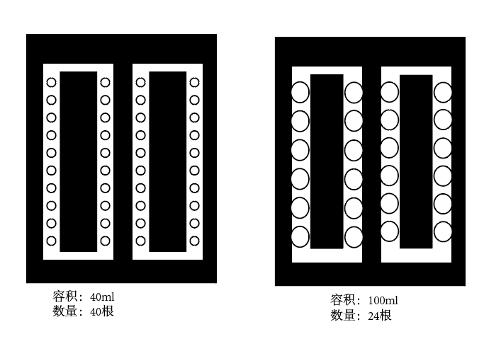

# 试管架布局图

## 试管架规格说明

### 左侧试管架（40ml规格）
- **容积**: 40ml
- **数量**: 40根试管
- **布局**: 4列 × 10行
- **排列方式**: 呈"凹"字形排列，中间留有空白区域
- **特点**: 试管孔径较小，适用于40ml容量的试管

### 右侧试管架（100ml规格）
- **容积**: 100ml
- **数量**: 24根试管
- **布局**: 4列，每列试管数不等
- **排列方式**: 呈"凹"字形排列，中间留有空白区域
- **特点**: 试管孔径较大，适用于100ml容量的试管

## 布局特点
1. 两种试管架均采用"凹"字形设计，中间预留操作空间
2. 左侧40ml试管架密度更高，可容纳更多试管
3. 右侧100ml试管架孔径更大，试管间距更宽
4. 这种布局设计便于机械臂或人工操作取放试管