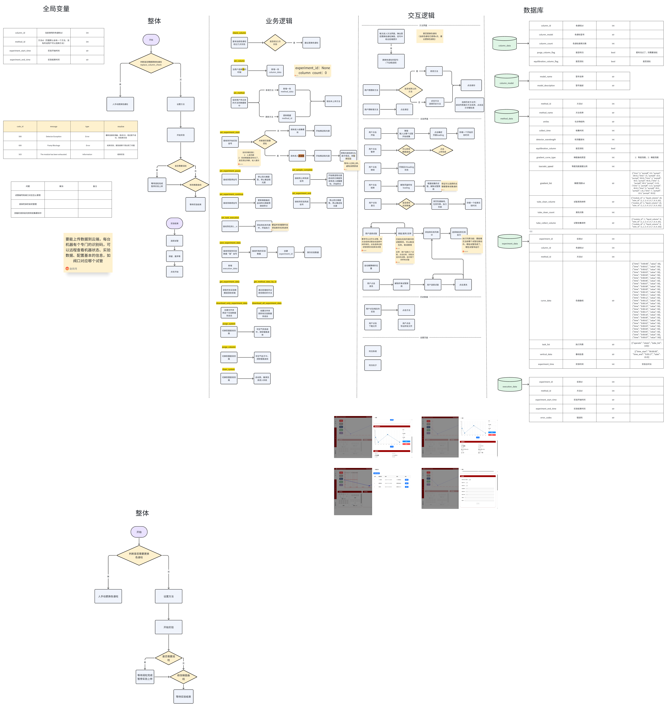

# 色谱分离系统业务逻辑

## 系统整体架构

系统分为四个主要模块：全局变量、整体流程、业务逻辑组和交互逻辑，以及数据库存储。

## 一、全局变量模块

### 设备配置表
| 参数 | 值 | 说明 |
|------|---|------|
| sample1 | - | 样品1配置 |
| sample2 | - | 样品2配置 |
| equipment_list | - | 设备列表 |

### 样品信息表
| 字段 | 类型 | 说明 |
|------|------|------|
| id | - | 样品ID |
| name | - | 样品名称 |
| type | - | 样品类型 |

### 流程控制参数
- 泵流速、压力阈值、收集时间等
- 系统状态标志位
- 错误处理机制配置

## 二、整体流程

### 主流程
1. **开始** → 判断是否有样品需要处理
2. **样品准备阶段**
   - 样品信息获取
   - 设备初始化
   - 管路清洗

3. **分离处理阶段**
   - 上样（Loading）
   - 洗脱（Elution）
   - 收集（Collection）
   - 检测（Detection）

4. **后处理阶段**
   - 数据保存
   - 设备清洗
   - 结果输出

## 三、业务逻辑组

### 1. 实验准备流程 (experiment_id_flow)
- **column_reset**: 柱子复位，将柱子恢复到初始状态
- **参数设置**: 设置实验参数（流速、压力、时间等）
- **管路清洗**: 执行系统管路清洗程序

### 2. 上样流程 (Loading Process)
主要步骤：
- 样品吸取
- 样品注入
- 平衡等待
- 压力监测

关键判断点：
- 压力是否超限
- 样品是否完全进入柱子
- 流速是否稳定

### 3. 洗脱流程 (Elution Process)
包含多个洗脱步骤：
- **洗脱液A**: 低浓度洗脱
- **洗脱液B**: 中浓度洗脱  
- **洗脱液C**: 高浓度洗脱
- **洗脱液D**: 清洗洗脱

每个洗脱步骤都包含：
- 洗脱液切换
- 流速控制
- UV检测
- 馏分收集判断

### 4. 收集流程 (Collection Process)
收集逻辑判断：
- UV吸收值判断（阈值判断）
- 收集时间窗口
- 收集管切换
- 收集量记录

### 5. 清洗流程 (Cleaning Process)
- 柱子清洗
- 管路清洗
- 收集器清洗
- 系统复位

## 四、交互逻辑

### 设备控制接口
- **泵控制**: 流速设置、启停控制
- **阀控制**: 多通阀切换、二通阀开关
- **检测器**: UV检测器数据读取
- **收集器**: 收集架位置控制

### 状态监测
- 实时压力监测
- 流速监测
- UV吸收值监测
- 液位检测

## 五、数据库模块

### 数据表结构

#### 1. 实验记录表 (experiment_record)
| 字段名 | 类型 | 说明 |
|--------|------|------|
| experiment_id | VARCHAR | 实验ID |
| sample_name | VARCHAR | 样品名称 |
| start_time | DATETIME | 开始时间 |
| end_time | DATETIME | 结束时间 |
| operator | VARCHAR | 操作员 |
| status | VARCHAR | 状态 |

#### 2. 馏分数据表 (fraction_data)
| 字段名 | 类型 | 说明 |
|--------|------|------|
| fraction_id | VARCHAR | 馏分ID |
| experiment_id | VARCHAR | 实验ID |
| tube_position | INT | 试管位置 |
| volume | FLOAT | 体积 |
| uv_value | FLOAT | UV值 |
| collect_time | DATETIME | 收集时间 |

#### 3. 过程数据表 (process_data)
| 字段名 | 类型 | 说明 |
|--------|------|------|
| data_id | VARCHAR | 数据ID |
| experiment_id | VARCHAR | 实验ID |
| timestamp | DATETIME | 时间戳 |
| pressure | FLOAT | 压力 |
| flow_rate | FLOAT | 流速 |
| uv_absorption | FLOAT | UV吸收 |

#### 4. 设备日志表 (equipment_log)
| 字段名 | 类型 | 说明 |
|--------|------|------|
| log_id | VARCHAR | 日志ID |
| equipment_name | VARCHAR | 设备名称 |
| operation | VARCHAR | 操作 |
| timestamp | DATETIME | 时间戳 |
| status | VARCHAR | 状态 |

## 六、错误处理机制

### 异常情况处理
1. **压力超限**: 
   - 立即停泵
   - 报警提示
   - 记录异常日志

2. **流速异常**:
   - 调整泵速
   - 检查管路
   - 自动重试机制

3. **收集错误**:
   - 收集架故障
   - 试管缺失
   - 自动跳过并记录

### 恢复机制
- 断点续传功能
- 实验数据自动保存
- 异常后的系统复位流程

## 七、优化建议

1. **并行处理**: 在不影响实验的前提下，某些清洗步骤可以并行执行
2. **智能判断**: 根据UV曲线自动判断收集起止点
3. **预警机制**: 提前预判可能的异常情况
4. **数据分析**: 实时数据分析和趋势预测